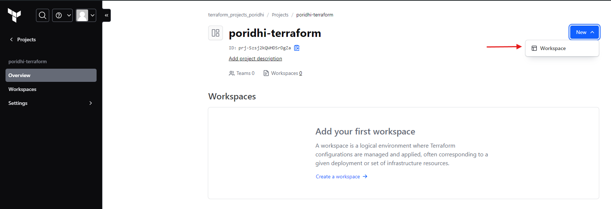
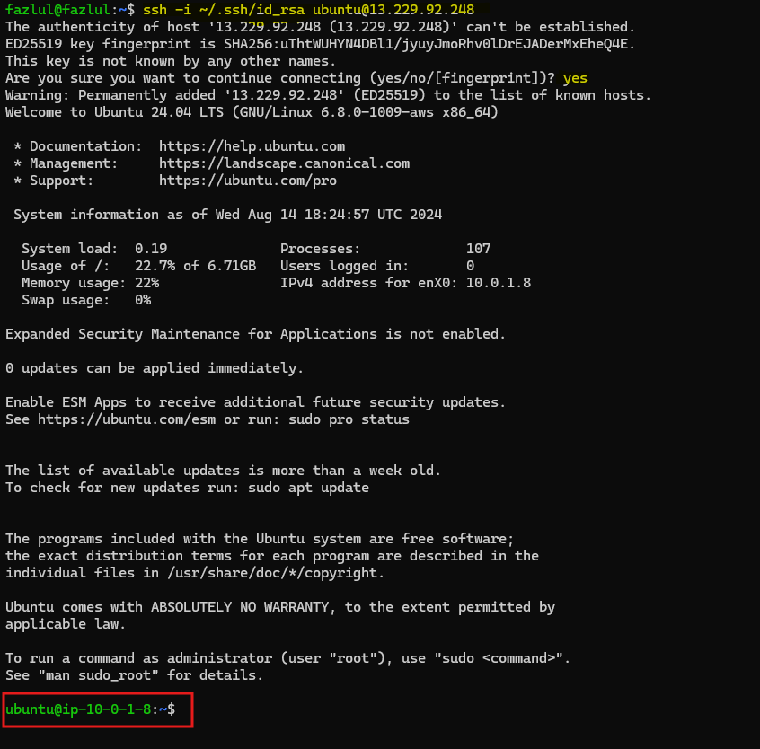

## Automating AWS VPC Deployment with EC2 using GitHub Actions and Terraform Cloud

In this lab, you will learn how to automate the deployment of an AWS infrastructure using Terraform and GitHub Actions. The infrastructure includes a Virtual Private Cloud (VPC) with a public subnet, an Internet Gateway (IGW), and an EC2 instance. The SSH public key used to access the EC2 instance will be securely managed using GitHub Secrets, and the Terraform state file will be stored in Terraform Cloud to ensure consistency and security across deployments.


## **Objectives**

By the end of this lab, you will be able to:

1. Automate the deployment of an AWS VPC with a public subnet using Terraform and GitHub Actions.
2. Securely manage and store an SSH public key using GitHub Secrets.
3. Deploy an EC2 instance within the public subnet.
4. Store and manage the Terraform state file in Terraform Cloud.
5. Output key information such as the EC2 instance’s public IP, VPC ID, Subnet ID, and Security Group ID.

## **Prerequisites**

Before starting this lab, ensure you have the following:

1. **GitHub Account**: A GitHub account to store your project and manage secrets.
2. **Terraform Cloud Account**: A Terraform Cloud account to manage the Terraform state file.
3. **AWS Account**: An AWS account with permissions to create and manage VPCs, EC2 instances, and related resources.
4. **SSH Key Pair**: An SSH key pair (`id_rsa` and `id_rsa.pub`) generated on your local machine.

## **Scenario**

You are a DevOps engineer tasked with automating the deployment of a simple AWS infrastructure, including a VPC with a public subnet and an EC2 instance accessible via SSH. Using Terraform, you'll define the infrastructure, store the state file in Terraform Cloud, and automate the deployment process with GitHub Actions. SSH keys will be securely managed using GitHub Secrets to ensure sensitive data remains protected. By the end of this lab, you'll have a fully automated pipeline that deploys your infrastructure on every push to your GitHub repository.

### Project directory structure for the lab:

```
terraform-aws-vpc-github-actions/
├── .github/
│   └── workflows/
│       └── deploy.yml
├── main.tf
├── variables.tf
└── outputs.tf
```

## **Lab Steps**

### **Step 1: Terraform Cloud Setup**

#### **1. Create a Terraform Cloud Project**
- **Sign in** to [Terraform Cloud](https://app.terraform.io/).
- Navigate to your organization.
- Go to **"Projects"** and click **"New Project"**.
- Name your project (e.g., "poridhi-terraform") and click **"Create Project"**.


#### **2. Create a Workspace**
- Within your project, go to the **"Workspaces"** tab.
- Click **"New Workspace"**.
- Choose **"CLI-driven workflow"**.
- Name your workspace (e.g., "vpc-workspace") and click **"Create Workspace"**.



### **3. Generate a Terraform Cloud API Token**
- Go to **User Settings** (top-right corner).
- Under **"Tokens"**, click **"Create an API Token"**.
- Name your token and click **"Create"**.
- Copy the token and add it to your GitHub Secrets as `TF_CLOUD_TOKEN`.


### **Step 2: Setting Up the VPC and Public Subnet**

#### **Create the Terraform Project Directory**

Start by creating a directory for your Terraform project:

```bash
mkdir terraform-aws-vpc-github-actions
cd terraform-aws-vpc-github-actions
```

#### **Create the Terraform Configuration Files**

Create the following files in your project directory:

1. **`main.tf`**: Contains the main configuration for setting up the VPC, subnet, security group, key pair, and EC2 instance.

```py
# main.tf

terraform {
  backend "remote" {
    organization = "your-project-name"

    workspaces {
      name = "your-workspace-name"
    }
  }
}

provider "aws" {
  region = "ap-southeast-1"
}

module "vpc" {
  source  = "terraform-aws-modules/vpc/aws"
  version = "4.0.0"

  name = "my-vpc-porodhi"
  cidr = "10.0.0.0/16"

  azs            = ["ap-southeast-1a"]
  public_subnets = ["10.0.1.0/24"]

  enable_dns_hostnames = true
  enable_dns_support   = true

  map_public_ip_on_launch = true

  tags = {
    Terraform   = "true"
    Environment = "dev"
  }
}

resource "aws_security_group" "ec2_sg" {
  vpc_id = module.vpc.vpc_id

  ingress {
    from_port   = 22
    to_port     = 22
    protocol    = "tcp"
    cidr_blocks = ["0.0.0.0/0"]
  }

  egress {
    from_port   = 0
    to_port     = 0
    protocol    = "-1"
    cidr_blocks = ["0.0.0.0/0"]
  }

  tags = {
    Name = "ec2-sg"
  }
}

resource "aws_key_pair" "main" {
  key_name   = "id_rsa"
  public_key = var.ssh_public_key
}

resource "aws_instance" "ec2" {
  ami           = "ami-060e277c0d4cce553"  # Example Ubuntu AMI
  instance_type = "t2.micro"
  subnet_id     = module.vpc.public_subnets[0]
  key_name      = aws_key_pair.main.key_name

  tags = {
    Name = "public-ec2-instance"
  }

  vpc_security_group_ids = [aws_security_group.ec2_sg.id]
}
```

2. **`variables.tf`**: Defines the variables used in the `main.tf` file, including the SSH public key.

```py
# variables.tf

variable "ssh_public_key" {
  type        = string
  description = "The public SSH key to be used for the EC2 instance"
}
```

3. **`outputs.tf`**: Specifies the outputs from your Terraform configuration, such as the public IP, VPC ID, Subnet ID, and Security Group ID.

```py
# outputs.tf

output "public_ip" {
  value = aws_instance.ec2.public_ip
}

output "vpc_id" {
  value = module.vpc.vpc_id
}

output "subnet_id" {
  value = module.vpc.public_subnets[0]
}

output "security_group_id" {
  value = aws_security_group.ec2_sg.id
}
```

### **Step 2: Setting Up GitHub Actions**

#### **2.1 Store AWS Credentials and SSH Keys in GitHub Secrets**

1. **Generate SSH Keys** (if you haven't already):

```bash
ssh-keygen -t rsa -b 4096 -C "your_email@example.com"
```

This generates a private key (`id_rsa`) and a public key (`id_rsa.pub`) in the `~/.ssh/` directory.

2. **Store Secrets**:

   - Navigate to your GitHub repository.
   - Go to **Settings > Secrets and variables > Actions > New repository secret**.
   - Add the following secrets:
     - **AWS_ACCESS_KEY_ID**: Your AWS access key ID.
     - **AWS_SECRET_ACCESS_KEY**: Your AWS secret access key.
     - **SSH_PRIVATE_KEY**: Paste the contents of your `id_rsa` file in `~/.ssh` directory.
     - **SSH_PUBLIC_KEY**: Paste the contents of your `id_rsa.pub` in `~/.ssh` directory.
     - **TF_CLOUD_TOKEN**: Add the Terraform Cloud API token as a secret.

     

#### **2.2 Create a GitHub Actions Workflow**

Create a `.github/workflows/deploy.yml` file in your repository with the following content:

```yaml
# .github/workflows/deploy.yml

name: Terraform AWS Deployment

on:
  push:
    branches:
      - main

jobs:
  terraform:
    runs-on: ubuntu-latest

    steps:
      - name: Checkout code
        uses: actions/checkout@v2

      - name: Setup SSH Key
        run: |
          mkdir -p ~/.ssh
          echo "${{ secrets.SSH_PRIVATE_KEY }}" > ~/.ssh/id_rsa
          echo "${{ secrets.SSH_PUBLIC_KEY }}" > ~/.ssh/id_rsa.pub
          chmod 600 ~/.ssh/id_rsa
          chmod 644 ~/.ssh/id_rsa.pub
          eval $(ssh-agent -s)
          ssh-add ~/.ssh/id_rsa

      - name: Install Terraform
        uses: hashicorp/setup-terraform@v1

      - name: Configure Terraform Credentials
        run: |
          mkdir -p ~/.terraform.d
          echo '{"credentials":{"app.terraform.io":{"token":"${{ secrets.TF_CLOUD_TOKEN }}"}}}' > ~/.terraform.d/credentials.tfrc.json

      - name: Terraform Init
        run: terraform init
        env:
          AWS_ACCESS_KEY_ID: ${{ secrets.AWS_ACCESS_KEY_ID }}
          AWS_SECRET_ACCESS_KEY: ${{ secrets.AWS_SECRET_ACCESS_KEY }}

      - name: Terraform Plan
        run: terraform plan -out=tfplan -var "ssh_public_key=${{ secrets.SSH_PUBLIC_KEY }}"
        env:
          AWS_ACCESS_KEY_ID: ${{ secrets.AWS_ACCESS_KEY_ID }}
          AWS_SECRET_ACCESS_KEY: ${{ secrets.AWS_SECRET_ACCESS_KEY }}

      - name: Save Terraform Plan
        uses: actions/upload-artifact@v2
        with:
          name: tfplan
          path: tfplan

      - name: Download Terraform Plan
        uses: actions/download-artifact@v2
        with:
          name: tfplan
          path: .

      - name: Terraform Apply
        run: terraform apply -auto-approve tfplan
        env:
          AWS_ACCESS_KEY_ID: ${{ secrets.AWS_ACCESS_KEY_ID }}
          AWS_SECRET_ACCESS_KEY: ${{ secrets.AWS_SECRET_ACCESS_KEY }}
```

### **Step 3: Validate and Apply the Configuration**

1. **Push your changes to GitHub**:

```bash
git add .
git commit -m "Add Terraform configuration and GitHub Actions workflow"
git push origin main
```

2. **Monitor the GitHub Actions Workflow**:
   - Go to the "Actions" tab in your GitHub repository
   - Select the latest workflow run to monitor the deployment process.

   

### **Step 4: Verify the Deployment**

Once the deployment is complete, you can verify the infrastructure by logging into your AWS Management Console. Navigate to the VPC and EC2 dashboards to check if the resources have been created.


You can also SSH into your EC2 instance using the private key:

```bash
ssh -i ~/.ssh/id_rsa ubuntu@<ec2-public-ip>
```


### **Conclusion**

In this lab, you have successfully automated the deployment of an AWS VPC, public subnet, and EC2 instance using Terraform and GitHub Actions. You have also learned how to securely manage SSH keys and store the Terraform state file in Terraform Cloud. This process ensures a consistent, repeatable, and secure way to manage your infrastructure deployments.